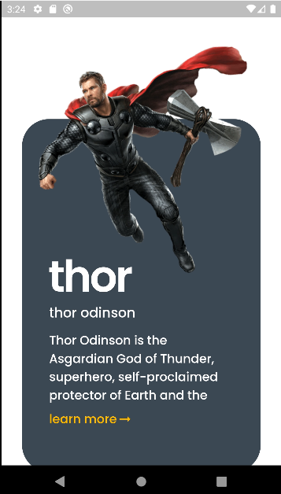

# best movie animation app


## Overview

Welcome to the Flutter App Marvel Showcase of movies! This Flutter application is designed to demonstrate the capabilities of our amazing app, providing a sneak peek into its features and functionalities.

## Screenshots

Here are some screenshots that showcase different parts of our app:


*Caption/description for Screenshot 1*

## Table of Contents

- [Installation](#installation)
- [Usage](#usage)
- [Features](#features)
- [Contributing](#contributing)
- [License](#license)

## Installation

To run this Flutter app locally, follow these steps:

1. Clone the repository:

    ```bash
    git clone https://github.com/yourusername/flutter-app-showcase.git
    ```

2. Navigate to the project directory:

    ```bash
    cd flutter-app-showcase
    ```

3. Install dependencies:

    ```bash
    flutter pub get
    ```

4. Run the app:

    ```bash
    flutter run
    ```

## Usage

Explore the features of our app to get a feel for its capabilities. Use the following command to start the app:

```bash
flutter run
